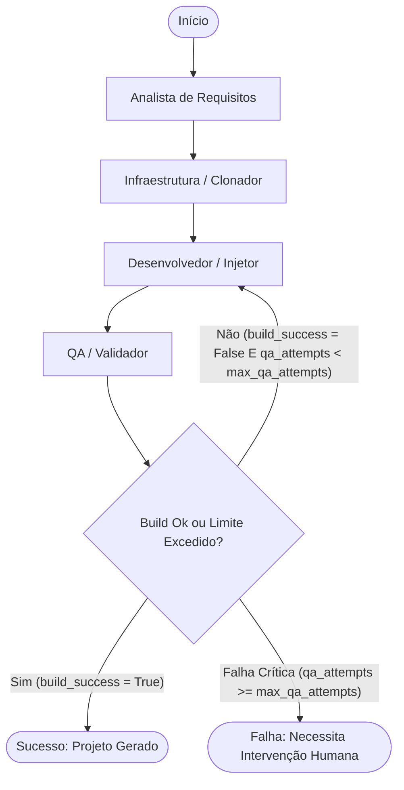

# Especificação Técnica: Orquestrador de Fábrica de IA

Este documento descreve a arquitetura, estrutura de dados, comportamento dos agentes e fluxo de execução do sistema **Orquestrador de Fábrica de IA**. O objetivo deste sistema é automatizar a geração de novos projetos de software customizados com base em dados de entrada (JSON de leads), utilizando templates pré-definidos ("Template Ouro") e técnicas de geração/injeção de código orientadas a agentes de IA.

---

## 1. Visão Geral do Sistema

O **Orquestrador de Fábrica de IA** é uma aplicação em Python baseada em **LangGraph** que automatiza o pipeline de criação de software customizado. O fluxo macro consiste em:

1. **Recepção de Dados**: O sistema recebe um arquivo ou payload JSON contendo informações de um lead e requisitos de customização.
2. **Análise de Requisitos**: Um agente de IA analisa os dados recebidos para extrair parâmetros, mapear escopo e validar consistência.
3. **Clonagem de Template**: O sistema clona um repositório ou pasta base denominado "Template Ouro" (repositório de referência estável).
4. **Injeção de Customização**: O agente Desenvolvedor injeta variáveis, gera código-fonte dinâmico e adapta arquivos de configuração do template para atender aos requisitos.
5. **Validação e Build (QA)**: Um agente de QA valida a integridade do build, executa testes e analisa estaticamente o código. Caso encontre erros, o fluxo retorna ao Desenvolvedor com o relatório de falha para correção (loop de autorrecuperação).

---

## 2. Stack Tecnológica

O projeto será desenvolvido utilizando as seguintes tecnologias e bibliotecas:

* **Linguagem**: Python 3.10+
* **Orquestração de Agentes**:
  * **LangGraph**: Framework principal para definição do fluxo de trabalho baseado em grafos de estado cíclicos.
  * **LangChain**: Integração de LLMs, Prompts e Cadeias de Processamento.
  * **Pydantic (v2)**: Modelagem de dados, validação de tipos de entrada/saída e validação do estado global.
* **Manipulação de Sistema de Arquivos e Git**:
  * **GitPython**: Operações de clonagem e gerenciamento de repositórios Git.
  * **shutil, os, pathlib**: Bibliotecas nativas do Python para manipulação robusta de arquivos e diretórios.
* **Execução de Processos e Validação**:
  * **subprocess**: Execução de scripts de build e testes em ambientes isolados (ex: `pytest`, `npm test`, `docker-compose`).
* **LLM Recomendada**: Modelos compatíveis com LangChain (ex: OpenAI GPT-4o, Anthropic Claude 3.5 Sonnet, ou modelos open-source equivalentes via Ollama).

---

## 3. Estrutura de Pastas

A estrutura de diretórios recomendada para garantir a modularidade e legibilidade do projeto é a seguinte:

```text
orquestrador-fabrica-ia/
├── ARCHITECTURE.md          # Este documento de especificação técnica
├── README.md                # Instruções de execução e setup do ambiente
├── requirements.txt         # Dependências do Python
├── main.py                  # Ponto de entrada da aplicação (carrega o JSON e roda o grafo)
├── config.py                # Configurações globais (chaves de API, caminhos de template, etc.)
├── src/
│   ├── __init__.py
│   ├── state.py             # Definição do AgentState (Pydantic / TypedDict)
│   ├── graph.py             # Construção e compilação do grafo LangGraph
│   ├── agents/              # Definição dos Prompts e Lógica dos Agentes
│   │   ├── __init__.py
│   │   ├── requirements_analyst.py  # Agente Analista de Requisitos
│   │   ├── infra_cloner.py          # Agente Infra (Clonador)
│   │   ├── code_injector.py         # Agente Desenvolvedor (Injetor)
│   │   └── qa_validator.py          # Agente QA (Validador)
│   └── utils/               # Funções utilitárias (Git, I/O, comandos OS)
│       ├── __init__.py
│       ├── file_helper.py
│       └── git_helper.py
├── gold_templates/          # Diretório local onde os "Templates Ouro" ficam armazenados (ou são baixados)
│   └── template_base_app/   # Exemplo de template padrão
└── workspace/               # Área de trabalho temporária/final onde os projetos customizados são gerados
```

---

## 4. Definição do Estado (AgentState)

O estado compartilhado entre os nós do grafo (`AgentState`) é modelado utilizando uma classe baseada em `Pydantic` ou `TypedDict` para garantir consistência estrutural. 

```python
from typing import List, Dict, Any, Optional
from pydantic import BaseModel, Field

class AgentState(BaseModel):
    # Entradas do Sistema
    lead_raw_json: Dict[str, Any] = Field(
        ..., 
        description="JSON bruto recebido com dados do lead e customizações solicitadas."
    )
    
    # Dados Processados (Analista de Requisitos)
    customization_requirements: Dict[str, Any] = Field(
        default_factory=dict,
        description="Dicionário estruturado de customizações validadas e mapeadas."
    )
    
    # Controle de Caminhos de Arquivo
    template_path: str = Field(
        "", 
        description="Caminho físico do Template Ouro utilizado como base."
    )
    target_project_path: str = Field(
        "", 
        description="Caminho físico final onde o projeto está sendo construído."
    )
    
    # Histórico de Build & Feedback do QA
    qa_attempts: int = Field(
        0, 
        description="Número de tentativas de correção feitas pelo Desenvolvedor."
    )
    max_qa_attempts: int = Field(
        3, 
        description="Limite máximo de tentativas de correção automática."
    )
    last_qa_report: Dict[str, Any] = Field(
        default_factory=dict,
        description="Relatório de erros compilado pelo QA (arquivos com falhas, logs de testes, etc.)."
    )
    build_success: bool = Field(
        False, 
        description="Flag indicando se o build/teste foi executado com sucesso pelo QA."
    )
    
    # Logs e Rastreabilidade do Fluxo
    execution_logs: List[str] = Field(
        default_factory=list,
        description="Lista de logs detalhados para debug de cada passo dos agentes."
    )
```

---

## 5. Definição dos Nós (Agentes)

Cada nó no LangGraph representa um agente com responsabilidade única e estrita. A comunicação entre os nós é feita exclusivamente pela leitura e gravação no `AgentState`.

### A. Analista de Requisitos (`requirements_analyst_node`)
* **Responsabilidade**: 
  1. Validar a presença das chaves obrigatórias no `lead_raw_json`.
  2. Traduzir o JSON informal do lead em parâmetros técnicos específicos.
  3. Mapear o template correspondente (ex: se o lead quer um e-commerce, seleciona o template de e-commerce).
* **Entrada**: `lead_raw_json`.
* **Saída**: Modifica `customization_requirements` e define `template_path`.

### B. Infraestrutura / Clonador (`infra_cloner_node`)
* **Responsabilidade**:
  1. Criar o diretório de destino do novo projeto dentro da pasta `workspace/`.
  2. Clonar o repositório ou copiar localmente a pasta do `template_path`.
  3. Validar se a cópia foi realizada com sucesso e definir permissões de leitura/escrita.
* **Entrada**: `template_path`.
* **Saída**: Define `target_project_path` e atualiza `execution_logs`.

### C. Desenvolvedor / Injetor de Código (`code_injector_node`)
* **Responsabilidade**:
  1. Ler os parâmetros de `customization_requirements`.
  2. Injetar o código customizado nos locais corretos (como arquivos `.env`, `config.js`, `settings.py`).
  3. Se houver um `last_qa_report` com erros de compilação ou testes, este nó deve ler os erros e reescrever/corrigir os trechos de código problemáticos no `target_project_path`.
  4. Incrementar a contagem em `qa_attempts`.
* **Entrada**: `customization_requirements`, `target_project_path`, `last_qa_report`, `qa_attempts`.
* **Saída**: Código modificado no `target_project_path`, incremento de `qa_attempts` e logs de alteração.

### D. QA / Validador de Build (`qa_validator_node`)
* **Responsabilidade**:
  1. Acessar o `target_project_path` e executar os scripts de validação (ex: linting, testes unitários, build local).
  2. Capturar erros de sintaxe, testes quebrados e logs de compilação.
  3. Avaliar se o build foi 100% bem-sucedido.
* **Entrada**: `target_project_path`.
* **Saída**: Atualiza `build_success` (True/False) e `last_qa_report` (detalhes in caso de falha).

---

## 6. Fluxo do Grafo (LangGraph Workflow)

O fluxo do grafo é cíclico e implementa um loop de autorrecuperação para correção de erros de build.



### Lógica da Condição de Retorno (Conditional Edge)

Após a execução do nó de **QA**, o grafo avalia as seguintes condições para determinar o próximo passo:

1. **Condição de Sucesso**: Se `build_success` for `True`, o fluxo prossegue para o nó de encerramento positivo (`EndSuccess`).
2. **Condição de Repetição (Loop Dev-QA)**: Se `build_success` for `False` **E** `qa_attempts` for menor que `max_qa_attempts`, o grafo redireciona o fluxo de volta para o nó do **Desenvolvedor** (`code_injector_node`). O Desenvolvedor lerá as informações presentes no `last_qa_report` para corrigir os bugs e reiniciar o ciclo de build.
3. **Condição de Aborto**: Se `build_success` for `False` **E** `qa_attempts` for maior ou igual a `max_qa_attempts`, o fluxo desvia para o estado de erro crítico (`EndFailure`), salvando o log de erros consolidado para intervenção humana.
