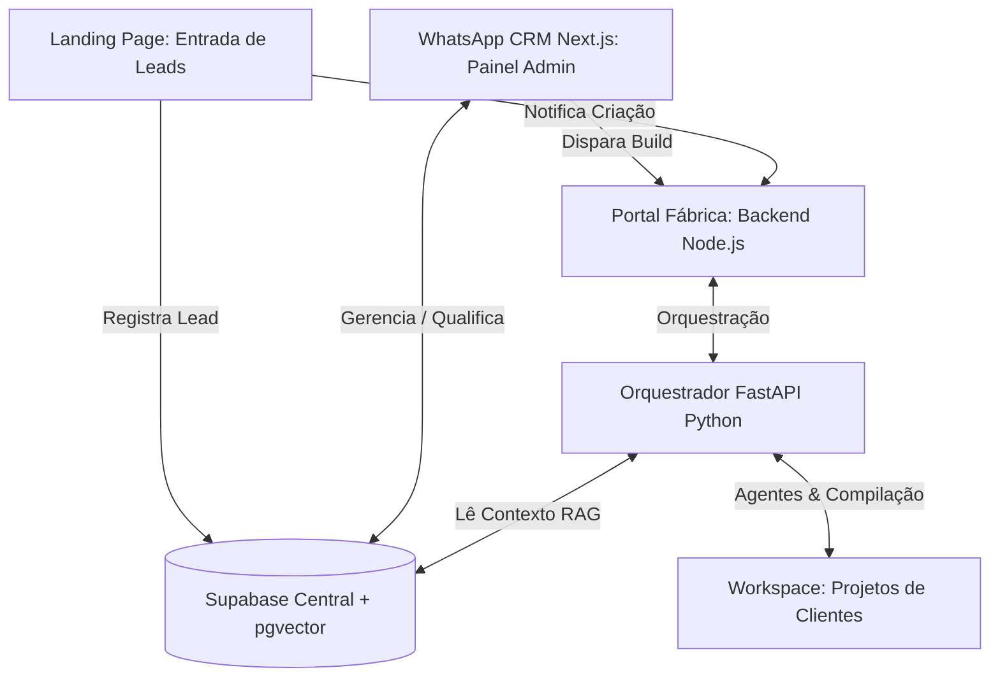
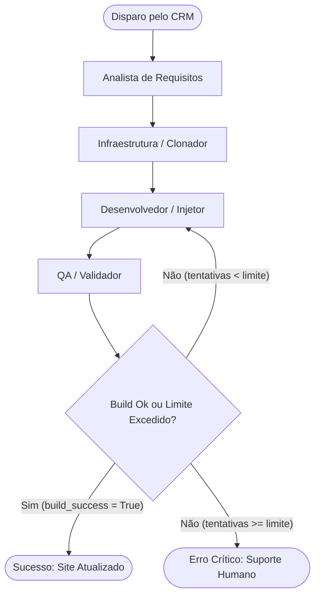

# Especificação Técnica: Orquestrador de Fábrica de IA & CRM

Este documento descreve a arquitetura global, a estrutura de dados, o comportamento dos agentes, o fluxo de dados e o ecossistema integrado da **Fábrica de Software com IA**, incluindo o **WhatsApp CRM (wacrm)**, o **Portal Fábrica** e o **Orquestrador de Agentes de IA**.

---

## 1. Visão Geral do Ecossistema

O ecossistema é uma solução em camadas para captação de leads, qualificação, enriquecimento com RAG (Retrieval-Augmented Generation) e geração autônoma de websites e aplicativos. O sistema é composto por 4 grandes pilares interligados por um banco de dados centralizado no Supabase:



1. **Landing Page & Configurador (Frontend React/Vite)**: Interface pública onde o cliente configura seu negócio, escolhe paletas de cores, seleciona os módulos necessários (Site, App, WhatsApp, Agendamento), insere links de inspiração/referência e submete o formulário, criando um lead com status `PENDENTE`.
2. **WhatsApp CRM (Next.js)**: Painel de controle interno do administrador. Permite gerenciar contatos, criar funis de vendas, coletar campos personalizados (ex: paleta de cores, diferencial, link do Instagram), gerenciar arquivos e documentos dos leads, e disparar o pipeline de geração via botão integrado na UI.
3. **Portal Fábrica Backend (Express Node.js)**: API intermediária que gerencia a fila de projetos no Supabase, monitora o status da compilação e serve como ponte entre a interface web e o orquestrador Python.
4. **Orquestrador de Agentes de IA (Python FastAPI & LangGraph)**: Motor inteligente composto por múltiplos agentes autônomos (Analista, Cloner, Desenvolvedor e QA) que lê o lead do banco de dados, recupera arquivos/contexto via RAG e compila fisicamente o projeto do cliente dentro do diretório `workspace/`.

---

## 2. Stack Tecnológica Global

### Frontend do Portal & Landing Page
- **Framework**: React.js com Vite
- **Estilização**: TailwindCSS
- **Conectividade**: REST API local (Porta `5000`)

### WhatsApp CRM (wacrm)
- **Framework**: Next.js 15+ (com App Router e React Server Components)
- **Estilização**: TailwindCSS & Shadcn UI
- **Banco de Dados & Autenticação**: `@supabase/supabase-js` (Conexão direta ao banco via REST API e Realtime)

### Backend de Integração
- **Framework**: Node.js com Express
- **Hospedagem / Porta**: Porta `5000` (Localhost)
- **Conexão**: `@supabase/supabase-js`

### Orquestrador de Agentes (Fábrica de IA)
- **Linguagem & Servidor**: Python 3.10+ com FastAPI (Porta `8000`)
- **Orquestração de Grafos**: **LangGraph** (fluxos de decisão cíclicos com autorrecuperação)
- **Integração de Modelos**: LangChain
- **Banco de Dados**: `psycopg2-binary` (conexão pooler via porta `6543`) e cliente Python do Supabase.
- **Modelos de IA**: `google/gemma-3-4b` via LM Studio local, ou OpenAI GPT-4o / Claude 3.5 Sonnet.

---

## 3. Estrutura de Diretórios do Monorepo

```text
full_stack/
├── ARCHITECTURE.md          # Este documento de especificação técnica
├── COMO_RODAR.md            # Guia de inicialização de todos os serviços
├── main.py                  # Servidor Python FastAPI do orquestrador
├── requirements.txt         # Dependências do Python (LangGraph, psycopg2, etc.)
├── ai_software_factory/     # Código fonte do orquestrador de IA
│   ├── .env                 # Chaves de API e URLs do Supabase (Orquestrador)
│   ├── agents.py            # Definição e prompts dos agentes (Analista, Dev, QA, etc.)
│   ├── dev_team.py          # Grafo de estados da equipe de desenvolvimento
│   └── rag_pipeline.py      # Pipeline de leitura de PDFs, embeddings e recuperação
├── wacrm/                   # Aplicação Next.js do WhatsApp CRM
│   ├── .env.local           # Configuração de conexão Supabase (CRM)
│   ├── supabase/            # Migrações SQL e schemas do CRM
│   └── src/components/      # Componentes UI (inclui contact-detail-view.tsx)
├── workspace/               # Pasta contendo os projetos finais compilados e o portal
│   ├── portal_fabrica/      # Frontend React e Backend Express do portal de leads
│   │   ├── backend/         # API Node.js (Porta 5000)
│   │   └── src/             # SPA React (Porta 5173)
│   ├── Marcianos/           # Exemplo de site de lanchonete gerado
│   └── Sorriso_Perfeito/    # Exemplo de site de clínica odontológica gerado
└── scratch/                 # Scripts auxiliares e arquivos SQL consolidados
    ├── consolidated_migrations.sql # Script unificado das tabelas do CRM
    └── apply_migrations.py         # Script Python para automação das tabelas
```

---

## 4. Arquitetura do Banco de Dados & RAG

### A. Tabela Principal de Fila (`fila_projetos`)
Controla o status de compilação dos sistemas dos clientes.
- `id` (serial, PK)
- `mensagem_lead` (text): Especificação textual gerada na Landing Page ou construída a partir do CRM.
- `status` (varchar): `pendente`, `processando`, `concluido` ou `erro`.
- `resultado_json` (jsonb): Logs de build, paleta aplicada, arquivos modificados e configurações aplicadas.

### B. Integração do Pipeline de RAG (Zero Custo)
Para ler documentos enviados pelos clientes (cardápios, folhetos de serviço, manuais e links), o ecossistema utiliza a extensão vetorial **`pgvector`** no Supabase:

1. **Ingestão**: O administrador anexa PDFs ou insere links na tela de detalhes do contato no CRM.
2. **Chunking & Vectorization**: O backend Python extrai o conteúdo do arquivo, fatia-o em partes menores e gera os embeddings usando um modelo vetorial gratuito local (via LM Studio ou biblioteca `sentence-transformers`).
3. **Persistência**: Os trechos de texto e seus respectivos vetores de alta dimensão são armazenados no Supabase na tabela `fila_projetos_documentos`:

```sql
CREATE EXTENSION IF NOT EXISTS vector;

CREATE TABLE fila_projetos_documentos (
    id UUID DEFAULT gen_random_uuid() PRIMARY KEY,
    projeto_id INT REFERENCES fila_projetos(id) ON DELETE CASCADE,
    conteudo TEXT NOT NULL,
    vetor VECTOR(1536), -- Dimensões correspondentes ao modelo de embeddings
    metadata JSONB,
    created_at TIMESTAMP WITH TIME ZONE DEFAULT CURRENT_TIMESTAMP
);
```

4. **Busca por Similaridade**: Quando a equipe de agentes de IA inicia o desenvolvimento do site de um cliente específico (ex: construindo a página de serviços), ela consulta o banco de dados usando busca por similaridade de cosseno, recuperando apenas os pedaços de texto relevantes do PDF/Cardápio daquele cliente e alimentando o prompt do Desenvolvedor de forma ultra-precisa.

---

## 5. Fluxo de Execução dos Agentes (LangGraph)

O pipeline de compilação de sites é gerenciado por uma equipe autônoma de agentes estruturados em um grafo cíclico com recuperação de erros:



- **Analista**: Lê a especificação do lead (`mensagem_lead`), realiza a busca de similaridade no banco RAG e monta a ficha de customização técnica.
- **Clonador**: Copia a estrutura limpa do *Template Ouro* para a pasta correspondente no `workspace/`.
- **Desenvolvedor**: Injeta as variáveis de estilo (Tailwind/CSS), reescreve os componentes com base nos dados do cliente (história, serviços recuperados do RAG) e cria a lógica de dados.
- **QA**: Executa testes de build (`npm run build`) e validações de links/sintaxe. Caso encontre erros, devolve o relatório de bugs para o desenvolvedor reescrever a seção defeituosa.
