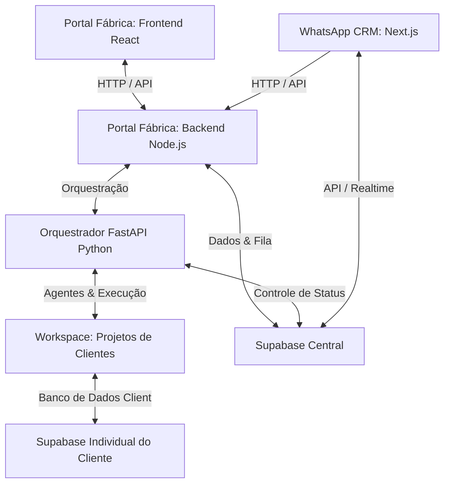

# Guia de Inicialização do Workspace - Fábrica de Software com IA

Este documento orienta sobre como rodar e testar todos os componentes do ecossistema, incluindo o **Orquestrador de Fábrica de IA**, o **Portal Fábrica** e os **Projetos de Clientes** (como `Marcianos` e `Sorriso Perfeito`).

---

## 1. Visão Geral dos Componentes

O repositório é composto por quatro tipos principais de aplicações:



1. **Orquestrador Backend (Python FastAPI - LangGraph)**: Responsável por rodar o grafo de agentes de IA para criar e validar projetos a partir de especificações.
2. **Portal Fábrica (Backend Node.js & Frontend React/Vite)**: O dashboard que gerencia a fila de projetos e exibe os resultados da automação de software.
3. **Projetos de Clientes (Frontend React + Backend Serverless Supabase)**: Os websites/aplicações finais gerados pela fábrica que ficam sob a pasta `workspace/`.
4. **WhatsApp CRM (Next.js)**: Painel CRM para visualizar/qualificar leads do WhatsApp e disparar a geração de sites através da Fábrica de IA.

---

## 2. Pré-requisitos Gerais

Antes de iniciar qualquer projeto, certifique-se de possuir:
* **Python 3.10+** (com um ambiente virtual criado na pasta `.venv` da raiz).
* **Node.js (versão 18+)** e **npm** instalados.
* Um terminal Powershell ou Git Bash aberto no diretório raiz do projeto `d:\full_stack`.

---

## 3. Como Rodar o Portal Fábrica (Orquestrador + Dashboard)

Para ter o sistema completo de geração de projetos funcionando, você deve iniciar 3 processos (de preferência em terminais separados).

### Passo 3.1: Iniciar o Orquestrador Backend (FastAPI / Python)
Este backend roda o fluxo dos agentes (Analista, Cloner, Desenvolvedor e QA) e escuta na porta `8000`.

1. Abra um terminal na raiz do projeto (`d:\full_stack`).
2. Ative o ambiente virtual Python e instale as dependências caso ainda não tenha feito:
   ```powershell
   # No Windows PowerShell:
   .venv\Scripts\activate
   pip install -r requirements.txt
   ```
3. Inicie o servidor FastAPI:
   ```powershell
   python main.py
   ```
   * O servidor estará disponível em: `http://localhost:8000`
   * Configuração de chaves de API / LLM em: [.env](file:///d:/full_stack/ai_software_factory/.env)

---

### Passo 3.2: Iniciar o Backend do Portal Fábrica (Node.js)
Este backend intermedia as requisições do frontend da fábrica, conecta-se à fila do Supabase e aciona o orquestrador Python.

1. Abra um novo terminal no diretório do backend do portal:
   ```powershell
   cd d:\full_stack\workspace\portal_fabrica\backend
   ```
2. Instale as dependências (se for a primeira vez):
   ```powershell
   npm install
   ```
3. Inicie o servidor em modo de desenvolvimento:
   ```powershell
   npm run dev
   ```
   * O servidor backend do portal rodará na porta `5000` (`http://localhost:5000`).
   * Configurações de acesso e URLs em: [backend/.env](file:///d:/full_stack/workspace/portal_fabrica/backend/.env)

---

### Passo 3.3: Iniciar o Frontend do Portal Fábrica (Vite / React)
Esta é a interface web para gerenciar e simular a criação de novos sites.

1. Abra um novo terminal no diretório raiz do portal:
   ```powershell
   cd d:\full_stack\workspace\portal_fabrica
   ```
2. Instale as dependências:
   ```powershell
   npm install
   ```
3. Inicie o servidor frontend:
   ```powershell
   npm run dev
   ```
   * O frontend abrirá no navegador, geralmente em: `http://localhost:5173`

> [!NOTE]
> Com estes três servidores ligados, você pode abrir o portal no seu navegador (`http://localhost:5173`) e submeter novas solicitações de leads para testar a geração automática.

---

## 4. Como Rodar os Projetos dos Clientes

Os projetos de clientes gerados pela fábrica estão localizados na pasta `workspace/` (ex: `workspace/Marcianos`, `workspace/Sorriso_Perfeito`). Eles não possuem um backend próprio escrito em Node ou Python; em vez disso, são **Serverless**, conectando-se diretamente ao **Supabase**.

Para executar o frontend de um cliente localmente:

### Passo 4.1: Preparar o Banco de Dados do Cliente (Supabase)
Cada cliente deve possuir seu próprio banco de dados Supabase para persistência de dados (como agendamentos e serviços).

1. Crie um novo projeto no painel do [Supabase](https://supabase.com/).
2. No menu **SQL Editor**, execute o script SQL inicial específico do projeto para criar as tabelas necessárias:
   * Por exemplo, para o projeto Marcianos, execute o script em [001_initial_schema.sql](file:///d:/full_stack/workspace/Marcianos/supabase_schema/001_initial_schema.sql).
   * Para o projeto Sorriso Perfeito, use o schema correspondente em sua respectiva pasta.

### Passo 4.2: Configurar as Variáveis de Ambiente do Cliente
1. Acesse a pasta do frontend do projeto de cliente escolhido. Por exemplo, para Marcianos:
   * Caminho: [Marcianos/frontend](file:///d:/full_stack/workspace/Marcianos/frontend)
2. Abra o arquivo `.env` localizado na raiz dessa pasta frontend:
   * Link do arquivo: [.env](file:///d:/full_stack/workspace/Marcianos/frontend/.env)
3. Substitua os placeholders pelas credenciais de conexão do projeto do Supabase que você criou:
   ```env
   VITE_SUPABASE_URL=https://sua-url-do-supabase.supabase.co
   VITE_SUPABASE_ANON_KEY=sua-chave-anonima-publica
   ```

### Passo 4.3: Iniciar o Frontend do Cliente
1. Abra um terminal na pasta frontend do cliente específico:
   ```powershell
   cd d:\full_stack\workspace\Marcianos\frontend
   ```
2. Instale as dependências (se necessário):
   ```powershell
   npm install
   ```
3. Execute o servidor de desenvolvimento Vite:
   ```powershell
   npm run dev
   ```
   * O app do cliente estará ativo em uma porta local, por exemplo `http://localhost:5174` (ou a próxima disponível).

---

## 5. Como Rodar o WhatsApp CRM (wacrm)

Este painel do CRM gerencia os seus contatos e leads qualificados e integra o fluxo de geração de sites por IA.

### Passo 5.1: Preparar o Banco de Dados do CRM (Supabase)
Antes de rodar o Next.js, as tabelas específicas do CRM precisam ser criadas no Supabase Central.

1. Abra o arquivo [scratch/consolidated_migrations.sql](file:///d:/full_stack/scratch/consolidated_migrations.sql) e copie todo o seu conteúdo.
2. Acesse o console do seu projeto do Supabase em [https://supabase.com](https://supabase.com).
3. No painel do projeto, abra o **SQL Editor**, clique em **New Query**, cole o script copiado e clique em **Run**.
4. *(Opcional)* Se tiver a senha do banco definida como `SUPABASE_DB_PASSWORD` em [ai_software_factory/.env](file:///d:/full_stack/ai_software_factory/.env), execute programaticamente via:
   ```powershell
   python scratch/apply_migrations.py
   ```

### Passo 5.2: Iniciar o Servidor do CRM
1. Abra um terminal na pasta do CRM:
   ```powershell
   cd d:\full_stack\wacrm
   ```
2. Inicie o servidor de desenvolvimento:
   ```powershell
   npm run dev
   ```
   * O CRM estará disponível localmente em: `http://localhost:3000`
   * As configurações de ambiente já estão prontas no arquivo [.env.local](file:///d:/full_stack/wacrm/.env.local).

### Passo 5.3: Disparar a IA a partir do CRM
1. Acesse o menu **Contacts** no CRM (`http://localhost:3000/contacts`).
2. Crie ou selecione um contato, defina suas informações e, na aba **Details**, clique no botão **Gerar Site com IA**.
3. O CRM enviará os dados do cliente para a API da Fábrica (`http://localhost:5000/api/projetos`) e disparará o processamento em segundo plano.

login:
senha:mano018

---

## 6. Como Executar Testes Rápidos e Simulações

Além de usar o Portal Fábrica, você pode testar componentes específicos diretamente pela linha de comando:

### Teste A: Simulação do Time de Desenvolvimento Autônomo
Para testar a atuação direta dos agentes desenvolvendo uma feature (ex: criação de uma Sidebar elegante) sem passar pela interface gráfica do portal:

1. Ative seu ambiente virtual na raiz do projeto (`d:\full_stack`).
2. Execute o script Python:
   ```powershell
   python testar_dev_team.py
   ```
   * Este script ([testar_dev_team.py](file:///d:/full_stack/testar_dev_team.py)) aciona diretamente a equipe de desenvolvimento (`dev_squad_graph`) sobre o projeto especificado no script (por padrão, `workspace/Sorriso_perfeito`).

### Teste B: Simulação de Envio de Leads (Webhook Externo)
Para testar o fluxo enviando payloads de simulação (como se novos clientes estivessem fazendo um pedido via um webhook do Make):

1. Configure a URL de destino do seu webhook no arquivo [testando.py](file:///d:/full_stack/testando.py).
2. Com seu ambiente virtual ativado, execute:
   ```powershell
   python testando.py
   ```
