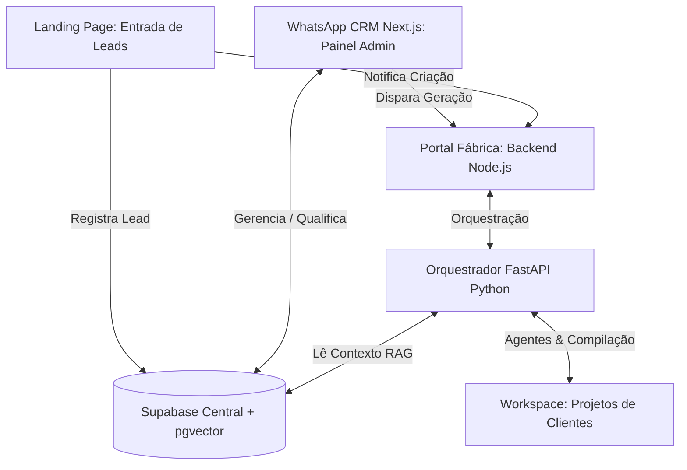

# 🚀 Fábrica de Software Autônoma com IA & CRM Integrado

Este projeto é um ecossistema completo e automatizado para captação de leads, qualificação inteligente, enriquecimento de contexto via **RAG (Retrieval-Augmented Generation)** e **geração 100% autônoma de websites e aplicativos PWAs** customizados para clientes.

O sistema integra inteligência artificial avançada utilizando **LangGraph** (grafos cíclicos de decisão com recuperação de falhas), **pgvector** no Supabase para busca semântica de arquivos dos clientes (cardápios, PDFs, etc.) e um painel de gerenciamento **CRM moderno em Next.js**.

---

## 🗺️ Visão Geral do Ecossistema

O fluxo de valor do projeto abrange desde o contato inicial do lead até o deploy e gerenciamento do site gerado:



---

## ✨ Funcionalidades Principais

### 1. Captação & Qualificação de Leads (WhatsApp CRM)
- **Painel CRM com Next.js 15+**: Interface administrativa moderna para gerenciar contatos, qualificar leads e criar funis de vendas.
- **Campos Customizados**: Configuração de paletas de cores, diferenciais do negócio, links do Instagram/inspirações e dados do estabelecimento.
- **Disparo com um Clique**: Botão direto na UI do contato para acionar a Fábrica de IA e gerar o site do cliente instantaneamente.

### 2. Pipeline de RAG (pgvector no Supabase)
- **Ingestão Inteligente**: Upload de manuais, cardápios, PDFs de serviços ou links de sites de referência no CRM.
- **Busca Semântica**: O backend Python fatiou e vetorizou os arquivos usando embeddings locais. Durante a escrita do código, a IA busca trechos relevantes nos documentos anexados do cliente para escrever um conteúdo ultra-fiel à realidade do estabelecimento.

### 3. Orquestrador de Agentes de IA (LangGraph)
Grafo cíclico estruturado com autorrecuperação e validação de código (QA):
- **Analista**: Processa o lead e busca contexto semântico relevante no banco de dados RAG.
- **Clonador**: Copia o *Template Ouro* limpo em React/Vite para a pasta do cliente.
- **Desenvolvedor**: Injeta estilos Tailwind/CSS, monta as seções com base nas informações do RAG e cria formulários.
- **QA (Garantia de Qualidade)**: Roda testes de compilação reais (`npm run build`). Caso quebre, repassa os logs de erro para o desenvolvedor reescrever a seção danificada até atingir 100% de sucesso.

### 4. Aplicação do Cliente Gerada (Ex: Marcianos Burger)
- **Página de Agendamento Moderno**: Formulário intuitivo de reservas integrado ao Supabase.
- **Gerenciador de Horários do Administrador**:
  - Visualização de chips/badges interativos com remoção rápida.
  - Inserção de horários individuais e **Gerador em Massa (Bulk Generator)** (define início, fim e intervalo para criar slots automaticamente).
  - Ordenação automática cronológica e ajustes dinâmicos de capacidade por slot.
  - Exibição/ocultação condicional do campo de observações (e limite de 50 caracteres) controlado diretamente pelo admin.
- **UX Otimizada para Mobile**:
  - **Barra superior retrátil**: Oculta-se suavemente ao rolar para baixo e reaparece ao rolar para cima.
  - **Botão "Recolher"**: Permite travar a barra superior no modo escondido para evitar incômodos de rolagem no celular.
  - **Rolagem Multidirecional Livre (Diagonal)**: O grid semanal de reservas pode ser movido em todos os eixos no celular (horizontal, vertical e diagonal) de forma unificada, mantendo o cabeçalho de datas (`thead`) fixo e alinhado no topo da tela (`sticky`).

---

## 🛠️ Stack Tecnológica

- **Frontend (Portal & Landing)**: React.js (Vite), TailwindCSS, Vanilla CSS.
- **WhatsApp CRM**: Next.js 15+ (App Router, Server Components), Shadcn UI, Supabase REST & Realtime Client.
- **Fábrica de IA & RAG**: Python 3.10+, FastAPI, LangGraph, LangChain, psycopg2-binary, pgvector, SentenceTransformers.
- **Ambiente de Simulação**: Fallback automático para `localStorage` no frontend caso a conexão com as tabelas de banco de dados do Supabase central ou individual não seja configurada.

---

## 📁 Estrutura de Diretórios do Projeto

```text
full_stack/
├── ARCHITECTURE.md          # Especificação técnica global do sistema
├── COMO_RODAR.md            # Guia prático de inicialização passo a passo
├── README.md                # Este guia de apresentação do ecossistema
├── main.py                  # Servidor Python FastAPI do orquestrador
├── requirements.txt         # Dependências do Python (LangGraph, psycopg2, etc.)
├── ai_software_factory/     # Código fonte do orquestrador de IA (Agentes & RAG)
├── wacrm/                   # Aplicação Next.js do WhatsApp CRM
└── workspace/               # Workspace físico dos projetos compilados e portais
    ├── portal_fabrica/      # Portal de monitoramento de geração (React + Express)
    ├── Marcianos/           # Exemplo de site gerado de hamburgueria com agendamento
    └── Sorriso_Perfeito/    # Exemplo de site gerado de clínica odontológica
```

---

## 🚀 Como Inicializar o Projeto

Para rodar todo o ecossistema localmente, você deve iniciar os servidores correspondentes. Consulte o guia detalhado em [COMO_RODAR.md](file:///d:/full_stack/COMO_RODAR.md) para obter comandos exatos e configurações de variáveis de ambiente.

1. **Orquestrador FastAPI (FastAPI)**:
   ```powershell
   .venv\Scripts\activate
   python main.py
   ```
2. **Express Backend do Portal (Node.js)**:
   ```powershell
   cd workspace/portal_fabrica/backend
   npm run dev
   ```
3. **Portal Frontend (Vite / React)**:
   ```powershell
   cd workspace/portal_fabrica
   npm run dev
   ```
4. **WhatsApp CRM (Next.js)**:
   ```powershell
   cd wacrm
   npm run dev
   ```
5. **Visualizar Site de Cliente (Marcianos)**:
   ```powershell
   cd workspace/Marcianos/frontend
   npm run dev
   ```

*Nota: O site gerado inclui suporte para ngrok no arquivo `vite.config.js` via `allowedHosts: true`, facilitando o acesso instantâneo e responsivo de seu smartphone local durante o desenvolvimento.*

**Ativação Ngrok**
no terminal digita: ngrok http 5173